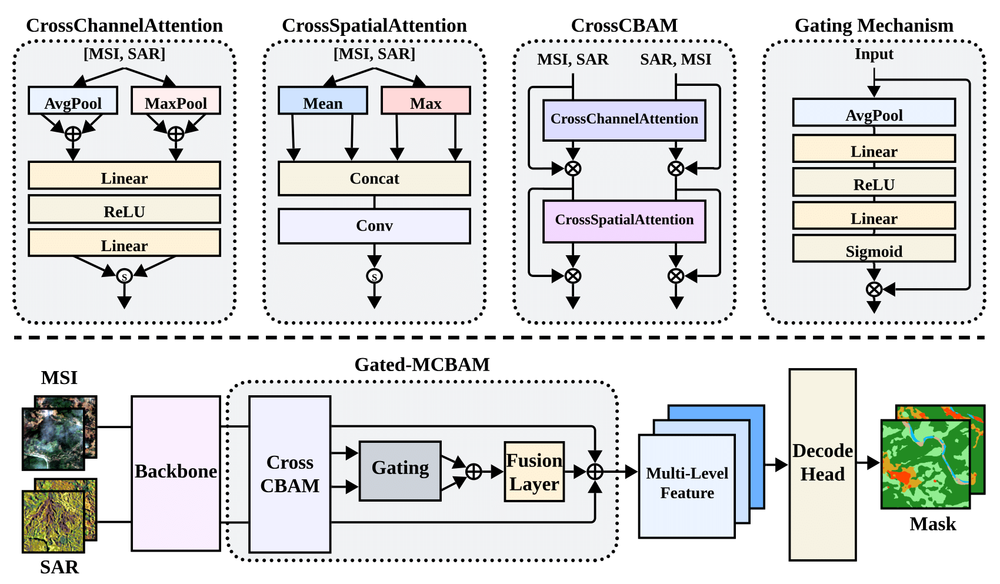

# Gated-MCBAM: Cross-Modal Block Attention Module with Gating Mechanism for Remote Sensing Segmentation@WHISPERS'2024

This repository contains the implementation of Gated-MCBAM, an innovative dual-stream framework that combines cross-modal attention and gating mechanisms for multi-source remote sensing segmentation. Our approach effectively integrates SAR and optical remote sensing data through a sophisticated attention mechanism. This implementation is based on the [MMSegmentation](https://github.com/open-mmlab/mmsegmentation) framework. original code is [here](https://github.com/jeongho-min/whispers2024_lumir).


## Model Architecture
<div align="center">
  
</div>
Our model features:
- Dual-stream architecture for processing SAR and MSI data
- Cross-modal attention mechanism for feature interaction
- Gating mechanism for adaptive feature selection
- Multi-scale feature fusion
- Integration of Swin Transformer and ResNet backbones

## Preprocessing

### 1. 12-Channel to 10-Channel Conversion
- We use both 12-channel and 10-channel data for ensemble predictions
- The original 12-channel data from YREB-dataset is converted to 10-channel format
- Conversion script: `tools/dataset_converters/12ch-10ch.py`
- Output is stored in the `multisen` folder

### 2. SAR Data Processing
- Process VV and VH channels into 3-channel format
- Create a new directory called 'SAR_AVG_TIF' containing:
  - Channel 1: VV
  - Channel 2: VH
  - Channel 3: (VV+VH)/2
- Processing script: `tools/dataset_converters/new_channel_yreb.py`

## Training

### Prerequisites
- Preprocessed dataset (multisen folder and SAR_AVG_TIF)
- Config files located in `workdir/whisper/` for different methods

### Training on a Single GPU

Basic usage:
```bash
python tools/train.py ${CONFIG_FILE} [optional arguments]
```

Example:
```bash
python tools/train.py ./workdir/whisper/Gcbamr50_swin_weight_256x256_upernet_last_v3/config.py
```

#### Optional Arguments
- `--work-dir ${WORK_DIR}`: Override the working directory
- `--amp`: Enable auto mixed precision training
- `--resume`: Resume from the latest checkpoint in the work_dir automatically
- `--cfg-options ${OVERRIDE_CONFIGS}`: Override config settings. For example:
  ```bash
  python tools/train.py ${CONFIG_FILE} --cfg-options model.encoder.in_channels=6
  ```
### Pretrained Models
The model uses ImageNet pretrained weights for both streams:
- EO Stream: ResNet backbone initialized with ImageNet pretrained weights
- MSI Stream: ConvNeXt/Swin Transformer backbone initialized with ImageNet pretrained weights
- The pretrained weights will be automatically downloaded during the first training

### Config Files
Configuration files for different methods can be found in their respective folders under:
```
workdir/whisper/
└── method_name/
    └── config.py
```

For detailed training configurations and options, please refer to the [MMSegmentation official documentation](https://mmsegmentation.readthedocs.io/).

## Model Weights

Pre-trained model weights can be downloaded from:
[Google Drive Link](https://drive.google.com/file/d/1fKRVMwmWSFI2TxDi-9z8e1bGPigLlm-7/view?usp=drive_link)

## Testing

### Individual Model Testing
You can test individual models using:
```bash
python tools/test.py \
    --config path/to/config.py \
    --checkpoint path/to/weights.pth
```

### Ensemble Testing
1. Download the model weights from our Google Drive
2. Save the weights in your local directory
3. Navigate to the `workdir` folder
4. Run `ensemble.py` with appropriate config files and weight paths


## Directory Structure
```
├── tools
│   ├── test.py
│   └── train.py
│   └── dataset_converters
│       └── new_channel_yreb.py
        └── 12ch-10ch.py
    └── ensemble.py
```


## Contact

For any questions or issues, please contact:
- Email: jeongho.min@unist.ac.kr
- Email: sbson0621@gmail.com

## License

[License information to be added]

## Citation

If you find this work useful in your research, please consider citing:
```
@INPROCEEDINGS{10876487,
  author={Min, Jeongho and Son, Sungbin and Kim, Hyeonjin and Back, Seunghyeok and Yoo, Jaejun and Kong, Youngkyun},
  booktitle={2024 14th Workshop on Hyperspectral Imaging and Signal Processing: Evolution in Remote Sensing (WHISPERS)}, 
  title={Gated-MCBAM: Cross-Modal Block Attention Module with Gating Mechanism for Remote Sensing Segmentation}, 
  year={2024},
  pages={1-5},
  keywords={Deep learning;Attention mechanisms;Convolution;Semantic segmentation;Bidirectional control;Logic gates;Sensors;Remote sensing;Synthetic aperture radar;Hyperspectral imaging;Multi-modal;Gating mechanism;Semantic segmentation;Remote sensing},
  doi={10.1109/WHISPERS65427.2024.10876487}}
```
